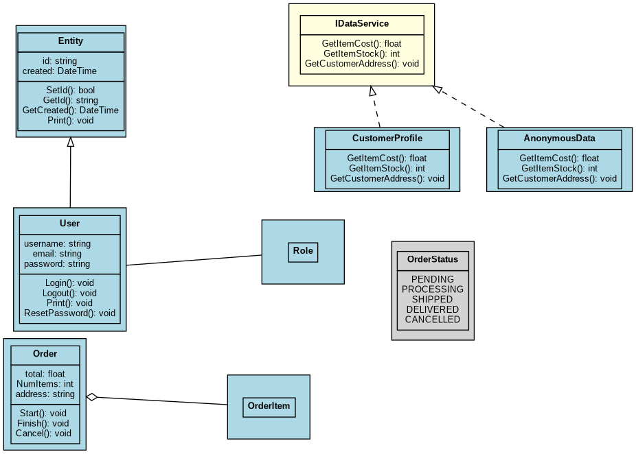

# Domain Package

[Home](../../index.md) > [Classes](../index.md) > Domain

Classes in the Domain package.

## Diagrams

### Domain

## Classes

- [AnonymousData](anonymousdata-44.md)
- [CustomerProfile](customerprofile-43.md)
- [Entity](entity-29.md)
- [Order](order-31.md)
- [OrderItem](orderitem-42.md)
- [Role](role-41.md)
- [User](user-30.md)
