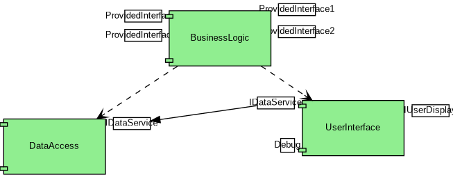

# Component: DataAccess

[Home](../index.md) > [Components](index.md) > DataAccess

**Package:** Components

**Description:** No description available

**Diagrams:**

*Interfaces on this diagram:*
- IUserDisplay (ProvidedInterface)
- IDataService (RequiredInterface)
- Debug (Port)
- IDataService (ProvidedInterface)
- ProvidedInterface1 (ProvidedInterface)
- ProvidedInterface2 (ProvidedInterface)
- ProvidedInterface3 (RequiredInterface)
- ProvidedInterface3 (RequiredInterface)

## Dependencies

**Used by:** BusinessLogic

