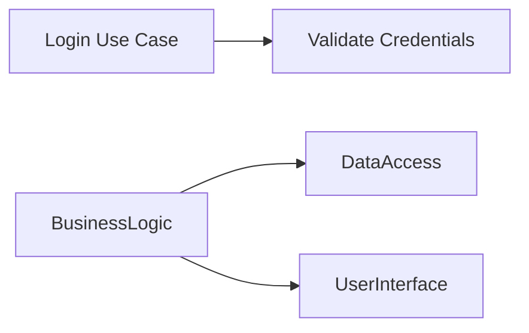

# Dependency Analysis

## Total Dependencies: 3

| Source | Target | Type |
|--------|--------|------|
| Login Use Case | Validate Credentials | UseCase → UseCase |
| BusinessLogic | DataAccess | Component → Component |
| BusinessLogic | UserInterface | Component → Component |

## Dependency Graph

