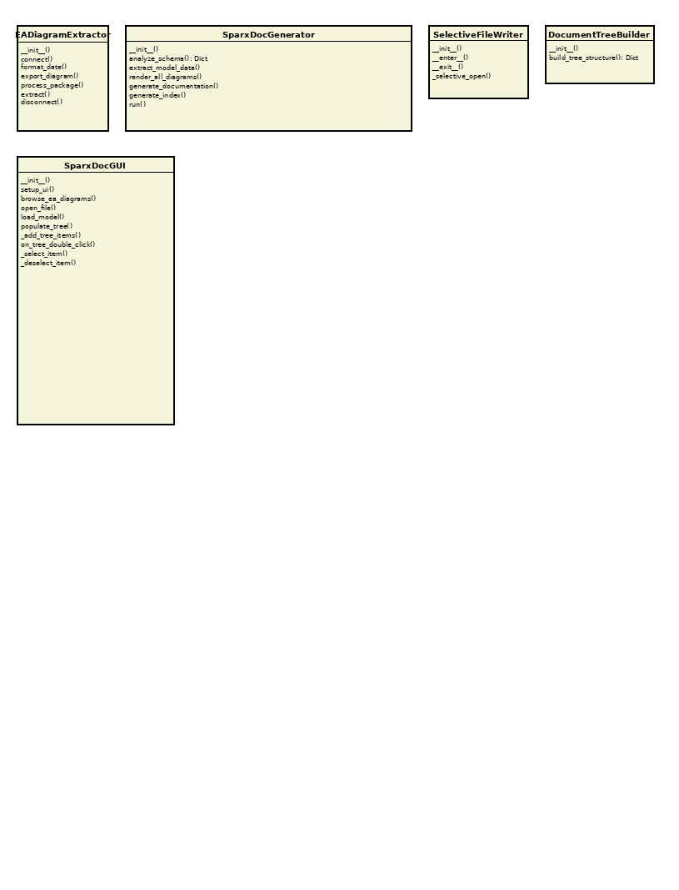

# Class: SparxDocGUI

[Home](../../index.md) > [Classes](../index.md) > [Eatools](index.md) > SparxDocGUI

**Package:** EATools

**Version: 1.0 | Modified: 2025-11-16 19:19:34 | GUID: {E52A89BE-7BA5-4f99-BF8D-505FD51BE143}**

**Description:** Main GUI application for Sparx documentation generator

## Diagrams

### EATools

## Methods

| Name | Parameters | Return Type | Description |
|------|------------|-------------|-------------|
| __init__ | self: unknown, root: unknown | void | - |
| _add_tree_items | self: unknown, parent: unknown, items: unknown | void | Recursively add items to tree |
| _deselect_all_recursive | self: unknown, item: unknown | void | Recursively deselect all items |
| _deselect_item | self: unknown, item: unknown, file_path: unknown | void | Deselect an item |
| _generate_index | self: unknown, output_dir: Path, quality_reporter: unknown | void | Generate main index/navigation document |
| _generate_preview | self: unknown, file_path: str | str | Generate a preview of the document content |
| _generate_reports_index | self: unknown, output_dir: Path, quality_reporter: unknown | void | Generate reports index document |
| _select_all_recursive | self: unknown, item: unknown | void | Recursively select all items |
| _select_item | self: unknown, item: unknown, file_path: unknown | void | Select an item |
| ask_create_folder | self: unknown, parent_dir: Path | Optional[Path] |  Ask user if they want to create a new folder in the selected directory  Args:     parent_dir: The parent directory selected by user  Returns:     Path to use for output (either parent_dir or new subdirectory),     or None if cancelled |
| browse_ea_diagrams | self: unknown | void | Browse for EA diagrams directory |
| deselect_all | self: unknown | void | Deselect all documents |
| generate_documentation | self: unknown | void | Generate selected documentation |
| generation_complete | self: unknown, output_path: unknown | void | Handle successful generation |
| generation_error | self: unknown, error_msg: unknown | void | Handle generation error |
| load_model | self: unknown | void | Load and extract model data |
| on_tree_double_click | self: unknown, event: unknown | void | Handle double-click to toggle selection |
| on_tree_select | self: unknown, event: unknown | void | Handle tree selection for preview |
| open_file | self: unknown | void | Open and load a .qea file |
| populate_tree | self: unknown | void | Populate the tree view with document structure |
| select_all | self: unknown | void | Select all documents |
| setup_ui | self: unknown | void | Setup the user interface |

