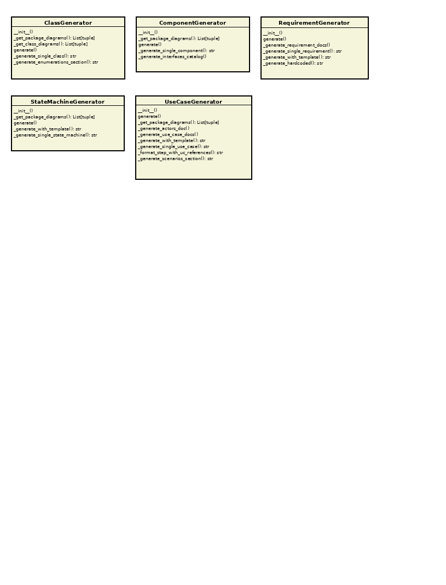

# Class: UseCaseGenerator

[Home](../../index.md) > [Classes](../index.md) > [Generators](index.md) > UseCaseGenerator

**Package:** generators

**Version: 1.0 | Modified: 2025-11-16 19:19:33 | GUID: {545A114E-AD07-427e-81BD-6F2DE371FC50}**

**Description:** Generates use case documentation

## Diagrams

### generators

## Methods

| Name | Parameters | Return Type | Description |
|------|------------|-------------|-------------|
| __init__ | self: unknown, extractor: unknown, output_dir: Path, template_dir: Path, diagram_guid_to_png: Dict[str, str] | void |  Initialize the use case generator  Args:     extractor: SparxExtractor instance with extracted data     output_dir: Output directory for documentation     template_dir: Directory containing templates (optional)     diagram_guid_to_png: Mapping of diagram GUIDs to PNG file paths |
| _format_step_with_uc_references | self: unknown, step: str, uc_object_id: int | str | Format a step to use proper UML notation for use case references |
| _generate_actors_doc | self: unknown, uc_dir: Path | void | Generate actors documentation |
| _generate_scenarios_section | self: unknown, object_id: int | str | Generate scenarios section for a use case |
| _generate_single_use_case | self: unknown, uc: unknown, uc_file: Path | str | Generate documentation for a single use case |
| _generate_use_case_docs | self: unknown, uc_dir: Path | void | Generate individual use case documents |
| _generate_with_template | self: unknown, uc: unknown, breadcrumbs: str | str |  Generate use case documentation using template  Args:     uc: UseCase object     breadcrumbs: Pre-generated breadcrumb navigation  Returns:     Rendered documentation |
| _get_package_diagrams | self: unknown, package_names: List[str] | List[tuple] |  Get diagrams for given package names  Args:     package_names: List of package names to find diagrams for  Returns:     List of (diagram_guid, diagram_name) tuples |
| generate | self: unknown | void | Generate use case documentation |

