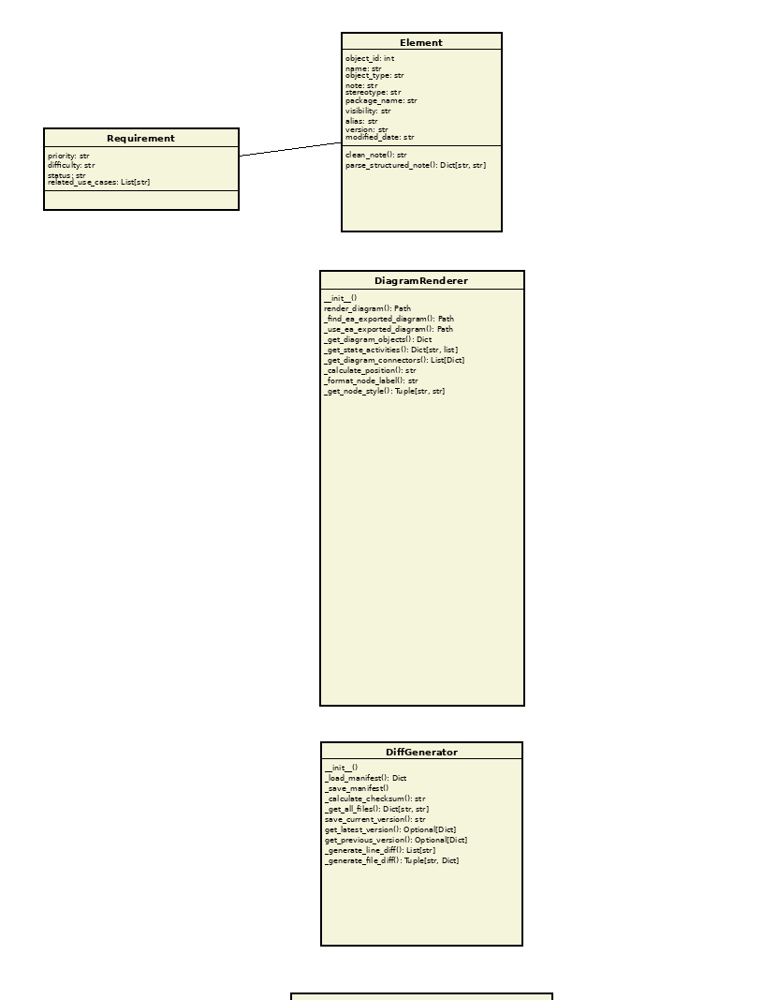

# Class: HTMLGenerator

[Home](../../index.md) > [Classes](../index.md) > [Sparx Ea Doc](index.md) > HTMLGenerator

**Package:** sparx_ea_doc

**Version: 1.0 | Modified: 2025-11-16 19:19:34 | GUID: {8BA64D28-3E22-472c-8A62-3B85C13440F1}**

**Description:** Generate HTML documentation from markdown files

## Diagrams

### sparx_ea_doc

## Methods

| Name | Parameters | Return Type | Description |
|------|------------|-------------|-------------|
| __init__ | self: unknown, docs_dir: Path, output_dir: Optional[Path], css_url: Optional[str] | void |  Initialize HTML generator  Args:     docs_dir: Directory containing markdown files     output_dir: Output directory for HTML files (default: docs_html in same parent as docs_dir)     css_url: Optional URL to external CSS stylesheet |
| _extract_breadcrumb | self: unknown, md_content: str | tuple[str, str] |  Extract breadcrumb from markdown content (first line if it starts with '[')  Args:     md_content: Markdown content  Returns:     Tuple of (breadcrumb_html, remaining_content) |
| _fix_md_links_to_html | self: unknown, html_content: str | str |  Convert all .md links to .html links in HTML content  Args:     html_content: HTML content with .md links  Returns:     HTML content with .html links |
| _generate_html_wrapper | self: unknown, title: str, content: str, breadcrumb: str | str |  Wrap markdown-generated HTML in a complete HTML document  Args:     title: Page title     content: HTML content (converted from markdown)     breadcrumb: Breadcrumb navigation HTML  Returns:     Complete HTML document |
| convert_file | self: unknown, md_file: Path | Path |  Convert a single markdown file to HTML  Args:     md_file: Path to markdown file  Returns:     Path to generated HTML file |
| generate_all | self: unknown | dict |  Convert all markdown files to HTML  Returns:     Dictionary with statistics (converted, failed, total) |

## Attributes

| Name | Type | Default | Const | Description |
|------|------|---------|-------|-------------|
| DEFAULT_CSS | var | """
    body {
        font-family: -apple-system, BlinkMacSystemFont, 'Segoe UI', Roboto, Oxygen, Ubuntu, Cantarell, sans-serif;
        line-height: 1.6;
        max-width: 1200px;
        margin: 0 auto;
        padding: 20px;
        color: #333;
        background: #f5f5f5;
    }

    .container {
        background: white;
        padding: 40px;
        border-radius: 8px;
        box-shadow: 0 2px 4px rgba(0,0,0,0.1);
    }

    h1, h2, h3, h4, h5, h6 {
        color: #2c3e50;
        margin-top: 1.5em;
        margin-bottom: 0.5em;
    }

    h1 {
        border-bottom: 3px solid #3498db;
        padding-bottom: 10px;
    }

    h2 {
        border-bottom: 2px solid #bdc3c7;
        padding-bottom: 8px;
    }

    a {
        color: #3498db;
        text-decoration: none;
    }

    a:hover {
        text-decoration: underline;
    }

    code {
        background: #f8f8f8;
        border: 1px solid #ddd;
        border-radius: 3px;
        padding: 2px 6px;
        font-family: 'Courier New', Courier, monospace;
        font-size: 0.9em;
    }

    pre {
        background: #f8f8f8;
        border: 1px solid #ddd;
        border-radius: 5px;
        padding: 15px;
        overflow-x: auto;
    }

    pre code {
        border: none;
        padding: 0;
        background: none;
    }

    table {
        border-collapse: collapse;
        width: 100%;
        margin: 20px 0;
    }

    th, td {
        border: 1px solid #ddd;
        padding: 12px;
        text-align: left;
    }

    th {
        background: #3498db;
        color: white;
        font-weight: bold;
    }

    tr:nth-child(even) {
        background: #f8f8f8;
    }

    blockquote {
        border-left: 4px solid #3498db;
        padding-left: 20px;
        margin-left: 0;
        color: #555;
        font-style: italic;
    }

    img {
        max-width: 100%;
        height: auto;
        border-radius: 5px;
        box-shadow: 0 2px 4px rgba(0,0,0,0.1);
    }

    ul, ol {
        margin: 10px 0;
        padding-left: 30px;
    }

    li {
        margin: 5px 0;
    }

    .toc {
        background: #ecf0f1;
        border-radius: 5px;
        padding: 20px;
        margin: 20px 0;
    }

    .toc ul {
        list-style-type: none;
        padding-left: 0;
    }

    .toc ul ul {
        padding-left: 20px;
    }

    .breadcrumb {
        color: #7f8c8d;
        font-size: 0.9em;
        margin-bottom: 20px;
    }

    .metadata {
        background: #ecf0f1;
        border-radius: 5px;
        padding: 15px;
        margin: 20px 0;
        font-size: 0.9em;
    }

    .metadata strong {
        color: #2c3e50;
    }

    hr {
        border: none;
        border-top: 2px solid #bdc3c7;
        margin: 30px 0;
    }
    """ | No | Default CSS for styling (embedded) |

